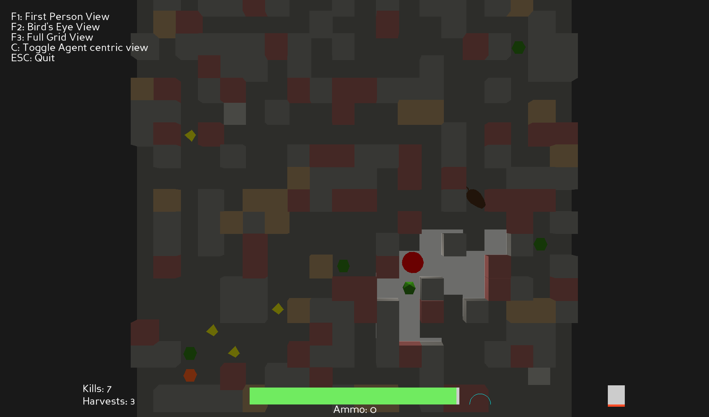
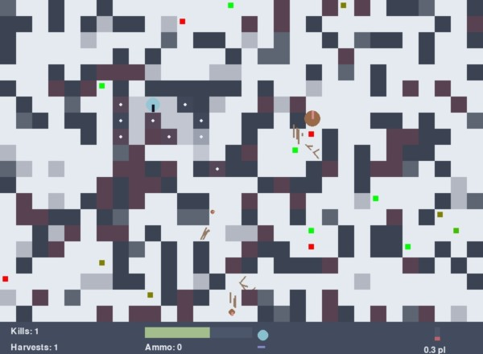

# HomeGym - MazeHarvest 

MazeHarvest is a grid-based reinforcement learning environment designed to train autonomous navigation agents in a partially observable environment. The agent must navigate complex terrains, interact with dynamic obstacles, and reach target locations using heuristic information and vector representation of objects in front of it to a certain distance. The environment simulates real-world navigation challenges, such as limited visibility, dynamic obstacles, and heuristic-based decision-making.



## Overview
MazeHarvest focuses on training agents to:

- **Navigate to target locations** using heuristic information like directional weights and ray perception.
- **Adapt to dynamic obstacles** such as walls, hostile entities, and environmental hazards.
- **Plan efficient paths** in partially observable environments with limited sensory inputs.

The environment is highly customizable, allowing users to configure terrain complexity, object proportions, and difficulty levels. It guarantees path connectivity and features a toroidal grid where edges wrap around, simulating a continuous space.

---

## Environment Features

### Random Generation
- Each grid is randomly generated and blockers are broken to guaranty the connectivity between free cells. (check [MazeGenerator](./homegym/envlib.py))
- Randomized placement of plants, moles, and walls, and the type distribution can shift during an episode after each spawn.
- Configurable difficulty and object types (check [constants.py](./homegym/constants.py)), can control object proportions and the spawn rates.

### World Dynamics
MazeHarvest models real-world abstractions to simulate navigation challenges:

- **Walls - Environmental Obstacles**:
  - Serve as obstacles the agent must navigate or interact with.
  - Three types:
    - **Breakable Walls**: Can be destroyed by the agent.
    - **Unbreakable Walls**: Permanent barriers that cannot be destroyed.
    - **Dangerous Walls**: Cause damage if collided with.
  - Abstract generic obstacles in real-world settings, influencing the agent’s path planning and health management.

- **Plants - Target Locations**:
  - Represent key locations the agent needs to reach and interact with.
  - Vary in priority, guiding the agent’s harvesting order, denoted by colors from green (low priority) to red (high priority).
  - Collecting a plant heals the agent by a small amount based on the priority level.
  - The agent receives heuristic information as directional weights around eight directions, indicating plant density and priority to help guide navigation.

- **Moles - Hostile Autonomous Creatures**:
  - Model independent, thinking creatures with complex behaviors.
  - Use a probabilistic policy combined with depth-restricted A* search to:
    - Actively seek and attack the agent.
    - Flee or ignore the agent at times, simulating natural, unpredictable behaviors.
    - Perform autonomous tasks beyond just aggression, mimicking real-world creature intelligence.
  - Vary in size and threat level, adding complexity to navigation. Killing a mole increases the agent health by a small level.
  - Abstract dynamic, intelligent adversaries that require strategic offense and defense.

- **Resources - Vision Flip & Ammunition**:
  - **Vision Flip**: Temporarily extends view range with a narrower field, cooldown 60s, encouraging strategic use.
  - **Ammunition**: Used to attack walls and moles. Spawns on the ground and can drop from dead moles with a random chance, adding a tactical layer to combat and resource use.

- **Health - Survival Pressure**:
  - The agent starts with 100 HP (hit points).
  - HP decreases when:
    - Attacked by hostile moles.
    - Colliding with dangerous walls.
    - Exposure to air poison buildup over time.
  - If HP reaches 0, the episode ends — simulating the agent’s "death."
  - Encourages risk-aware behavior, promoting avoidance of threats and urgency in task completion.

- **Air Poison - Time Pressure**:
  - Introduced to discourage slow or passive behavior.
  - Poison level increases every step while plants are present.
  - Collecting plants reduces the poison level.
  - High poison levels cause HP to drop over time, simulating environmental degradation.
  - Forces the agent to act efficiently and complete tasks quickly to survive.

---

## Agent Overview

### Capabilities
The agent is equipped with basic navigation and interaction abilities:
- **Navigation**: Move in four directions and adjust facing direction to explore the grid.
- **Interaction**: Automatically interact with objects in the current cell, such as picking up ammo or harvesting plants.
- **Vision Modes**: Switch between normal and hunter vision to adapt to different scenarios. Normal vision offers a wide field of view, while hunter vision provides extended range but a narrower field.
- **Combat**: Attack or shoot objects to clear paths or defend against hostile entities.

The agent relies on local observations and heuristic data, such as weighted distances to targets, to make decisions. This mimics real-world navigation systems that use GPS-like information and sensory inputs to reach destinations.

### Action Space 

**Total Actions:** 10. (4 Movements,2 Face Turns, 2 Attack, 1 Vision Flip & 1 for no-action).

| Key | Name | Action | 
| --- | ---- | ------ |
| 0 | None | No Action |
| 1 | Left | Turn Left | 
| 2 | Right | Turn Right | 
| 3 | Switch Vision | Switch vision to hunter if cool down is over, when vision is hunter switch back to normal | 
| 4 | Shoot | If has ammo shoot, other wise attack | 
| 5 | Attack | Attack objects in opposite tile |
| 6 | Front | Move Front | 
| 7 | Right | Move Right | 
| 8 | Back | Move Back | 
| 9 | Left | Move Left | 


### Observation Space
The agent's observations consist of:

1. **Ray Perception**:
   - Sends `num_rays` in the facing direction.
   - Returns a array of perceived objects:
     - `(normalized angle, normalized distance, object ID, object type, object health, relative facing direction)`.
   - The object type will lie in range between 0 to 1, 0 represent the base type and 1 represent the extreme type

2. **View Modes**:
   - **Normal Vision**:
     - Wide field of view (180 degrees).
     - Limited range.
   - **Hunter Vision**:
     - Narrow field of view.
     - Longer range.

3. **Heuristics**:
   - Global plant heuristics.
   - Local mole heuristics (1.5x hunter vision range).

4. **Damage Directions**:
   -  Sum of damages from all 8 directions relative to the agent.

5. **Agent State**:
   - Health, ammo, air toxicity level, vision mode, vision switch cooldown, and facing direction.

**Total Observation:** 30 fixed-length values + arbitrary-length ray perception (`N x 6`).


| Observation           | Shape | Description |
|--------------------------|-----------|-----------------|
| **Ray Perception**       | (N, 6)    | A list of object representations for each unique object that the emitted rays have passed through or hit. Rays can pass through non-vision-blocking objects. Each entry contains 6 values representing the perceived object attributes. |
| **Loot Heuristics**      | (8,)      | A directional heuristic (in 8 directions relative to the agent) representing the presence and quality of nearby plants. Computed as a weighted sum: <br>  **Loot Heuristic** = ∑ (10 × *plant_type* × (1 − *distance* / *max_dist*))<br> The higher the plant's toxicity and the closer it is, the greater its contribution to the sum. |
| **Mole Heuristics**      | (8,)      | Similar to Loot Heuristics but for nearby moles. Only moles within a radius of **1.5 × hunter vision radius** are considered. The same weighted formula is applied: <br> **Mole Heuristic** = ∑ (10 × *mole_type* × (1 − *distance* / *max_dist*)) |
| **Damage Directions**    | (8,)      | Total accumulated damage from each of the 8 directions surrounding the agent, relative to the agent's current facing direction. |
| **Health**               | (1,)      | The agent’s current health normalized by maximum health:<br> **Health** = agent_health / max_health |
| **Air Poison Level**     | (1,)      | The true environmental poison concentration, not the "pl" (poison level) display which represents the **damage per step**. The damage may decrease in large environments or those with more walls to maintain balance. |
| **Ammo Inventory**       | (1,)      | The ratio of current ammo to the maximum ammo capacity:<br> **Ammo Ratio** = ammos / MAX_AMMOS |
| **Vision Mode** | (1,) | 1 if it is in hunter vision else 0 |
| **Vision Switch Cooldown** | (1,)    | Indicates whether the agent can switch vision modes:<br> 1 = available to switch<br> 0 ≤ value < 1 = cooldown in progress |
| **Facing Direction**     | (1,)      | The agent’s current facing direction, encoded as an integer or direction-specific label (e.g., 0 = North, 1 = North-East, etc.). |

**Note:**
The observations with shape (1,) will be combined into a single observation called **player_state** with shape (6, ).

---
## Rewards

- **Alive Bonus**:  
  +0.05 for each step the agent stays alive.

- **Combat**:  
  - -0.05 for shooting.  
  - +0.2 for a shot hitting a mole.  
  - +(0.3 × mole_type) for killing a mole.

- **Resource Collection**:  
  - +0.01 for picking up ammo.  
  - +1.0 for any successful harvest.  
  - +(1.0 × plant_type) as a bonus based on the plant type.  
  - +(0.8 × (1 − time_taken / max_time)) as a time-based bonus for faster harvests.

- **Penalties**:  
  - −(0.6 × (1 − health / max_health)) as a health-based penalty.  
  - −(0.8 × (min(dps, 2) / 2)) poison level penalty, based on damage per step (capped at 2).  
  - −50 for reaching a terminal state (agent death).

- **Exploration Bonus**:  
  +0.1 for visiting a new or rarely visited tile.  
  At each step, `visited_cells[current_cell]` is incremented.  
  Visit counts decay throughout the episode by a factor of 0.99.  
  The bonus is only given if `visited_cells[current_cell] ≤ 1.3`.

---

## Mission: Navigate.

The agent must efficiently navigate to target locations while avoiding obstacles and threats. It uses weighted straight-line distances from eight directions to the target locations as heuristics, and can only see what’s in front of it through ray perception. It needs to plan ahead and adapt as the environment changes.

---

## How to Use?

The interface is similar to [Gymnasium](https://gymnasium.farama.org/) environments but doesn't have all of its features.

### Setup
Using a venv is recommended.
```sh
cd homegym # Not homegym/homegym/ src directory
pip install -e .
``` 

### Quick Start
```python
from homegym import MazeHarvest
import pygame
import time

env = MazeHarvest(width=20, height=30, env_mode="hard", seed=420, num_rays=21, max_steps=1000)

obs = env.reset(seed=1)
pygame.init()

d_height, d_width, _ = env.render().shape
screen = pygame.display.set_mode((d_height, d_width))

running = True
while running:
    for event in pygame.event.get():
        if event.type == pygame.QUIT:
            running = False

    action = env.action_space.sample()

    observation, reward, done, trunc = env.step(action)

    rgb_array = env.render()
    surf = pygame.surfarray.make_surface(rgb_array)
    screen.blit(surf, (0, 0))
    pygame.display.flip()
    time.sleep(0.01)

    if done:
        break

pygame.quit()
```



**There are two render modes available:** when `agent_center=True`, the agent remains in a bounding box in center of the grid, and moving outside the box shifts the environment while the agent stays on the same position (similar to MOBA-style games); when set to False, the grid remains fixed, and the agent moves across the grid. The default is True.

#### Rendering in 3D 
To render the environment in 3D, use the `RealLifeSim` class from the `render3d.py` module. This class uses Panda3D to create a 3d Visulization of the environment. (It just maps the board objects to 3D Objects and the frames between steps are interpolated to create smooth transition)

**Rendering Modes:**
- **First Person Perspective (FPP)**: Offers a view from the agent's perspective.
- **Bird's Eye View**: Provides an overhead view of the environment.
- **Full Grid View**: Displays the entire grid from above (similar to the 2d render).

**Policy Function:**
The `policy_function` parameter in `RealLifeSim` allows you to define a custom policy for the agent's actions. This function should have a reference to the environment, take steps on the environment, and manage the agent, including handling hidden states. It should return a boolean indicating whether the episode has ended (done or truncated). For an example, refer to `experiments/runsim3d.py`. If no policy function is provided, random actions will be sampled.


```python 
from homegym.mazeharvest import Environment
from homegym.render3d import RealLifeSim

class MyPlayer: ...

env_width, env_height = 20, 20
env = Environment(env_width, env_height, env_mode="hard", seed=50)
player = MyPlayer(env)
env.reset()

sim = RealLifeSim(env=env, action_interval=0.2, policy_function=player.policy)
try:
    sim.run()
finally:
    sim.destroy()
```

This code snippet initializes the MazeHarvest environment and starts the 3D simulation using Panda3D. The `RealLifeSim` class handles rendering and interaction within the 3D space with the given policy function.


### Observation Unwrapping
```python
perception, loot_heuristics, mole_heuristics, damage_directions, agent_state = observation
```
