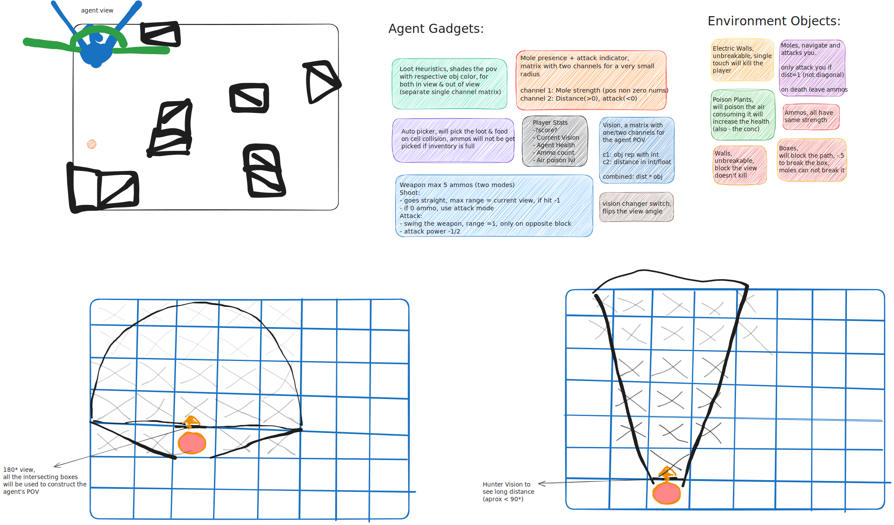

# HomeGym-MazeHarvest-v0

MazeHarvest is a grid-based survival reinforcement learning environment where an agent must protect the environment from toxic plants while defending itself against hostile moles. The world is fully connected (toroidal space), meaning all edges wrap around to their opposite sides.



## Overview
In MazeHarvest, the agent's primary tasks are:

- **Harvesting plants** to reduce environmental toxicity.
- **Defending against moles** that actively hunt the agent.

The environment is procedurally generated with the following guarantees and features:

- **Path connectivity**: There is always at least one path between any two free cells.
- **World wrapping**: The grid is fully connected (toroidal).
- **Limited visibility**: The agent cannot see the entire grid but perceives its surroundings through ray perception.
- **Dynamic threats**: Plants & Moles are spawned randomly and the difficulty will progressively increase.

The agent also receives heuristic information about threats and environmental conditions, adding strategic depth.

---

## Environment Features

### Procedural Generation
- Each grid is procedurally generated with guaranteed connectivity between free cells. (check [MazeGenerator](./homegym/envlib.py))
- Randomized placement of plants, moles, and walls, and the type distribution can shift during an episode.
- Configurable difficulty and object types (check [constants.py](./homegym/constants.py)).

### World Dynamics
- **World wrapping**: The grid wraps around like a globe.
- **Moles**: 
  - Use a depth-restricted A* algorithm to actively pursue the agent.
  - Drop ammo and heal the agent when killed.
- **Plants**:
  - Increase environmental toxicity at each time step.
  - Provide healing and reduce toxicity when harvested.
- **Walls**:
  - Breakable walls require up to 1 to 2 hits by fist or 1 shot to destroy.
  - Unbreakable walls can not be destroyed and will not deal damage.
  - Electric walls, when agent hits an electric wall it will lose some health.

---

## Agent Overview

### Capabilities
- **Current Cell Auto Actions**: Pick up ammo (will not pick if inventory is full) and harvest plants from the current cell.
- **Combat**: Attack with fists or shoot with ammo (fists can be used even with/without ammo).
- **Navigation**: Move in 4 directions and change facing direction (left or right).
- **Vision modes**: Switch between normal and hunter vision modes.

**Total Actions:** 10. (4 Movements,2 Face Turns, 2 Attack, 1 Vision Flip & 1 for no-action).

### Observation Space
The agent's observations consist of:

1. **Ray Perception**:
   - Sends `num_rays` in the facing direction.
   - Returns a array of perceived objects:
     - `(normalized angle, normalized distance, object ID, object type, object health, relative facing direction)`.

2. **View Modes**:
   - **Normal Vision**:
     - Wide field of view (180 degrees).
     - Limited range.
   - **Hunter Vision**:
     - Narrow field of view.
     - Longer range.

3. **Heuristics**:
   - Global plant heuristics.
   - Local mole heuristics (1.5x hunter vision range).

4. **Damage Directions**:
   - A normalized distribution of damage from all 8 directions relative to the agent.

5. **Agent State**:
   - Health, ammo, air toxicity level, vision mode, and facing direction.

**Total Observation:** 29 fixed-length values + arbitrary-length ray perception (`N x 6`).

---

## Rewards
- **Survival**: +1 for each step.
- **Combat**:
  - -0.2 for shooting.
  - +0.7 for a shot hitting a mole.
  - +11 * mole type for killing a mole.
- **Resource Collection**:
  - +0.5 for picking up ammo.
  - +47 * plant type for harvesting a plant.
- **Penalties**:
  - -(100 + air toxicity level / 10) if the agent dies.

---

## Goals
- **Easy Mode**:
  - Navigate a simple maze to harvest plants and survive.
- **Complex Mazes** (wall proportion > 0.4):
  - Navigate complex mazes while accomplishing tasks.


---

## How to Use?

The interface is similar to [Gymnasium](https://gymnasium.farama.org/) environments but doesn't have all of its features.

### Setup
Using a venv is recommended.
```sh
cd homegym # Not homegym/homegym/ src directory
pip install -e .
``` 

### Quick Start
```python
from homegym import MazeHarvest
import pygame
import time

env = MazeHarvest(width=20, height=20, env_mode="easy", seed=420, num_rays=21, max_steps=1000)

obs = env.reset(seed=1)
pygame.init()

d_height, d_width, _ = env.render().shape
screen = pygame.display.set_mode((d_height, d_width))

running = True
while running:
    for event in pygame.event.get():
        if event.type == pygame.QUIT:
            running = False

    action = env.action_space.sample()

    observation, reward, done, trunc = env.step(action)

    rgb_array = env.render()
    surf = pygame.surfarray.make_surface(rgb_array)
    screen.blit(surf, (0, 0))
    pygame.display.flip()
    time.sleep(0.01)

    if done:
        break

pygame.quit()
```


(not a sample for the above snippet, the grid size is large and the difficulty level is very hard)

### Observation Unwrapping
```python
perception, loot_heuristics, mole_heuristics, damage_directions, agent_state = observation
```